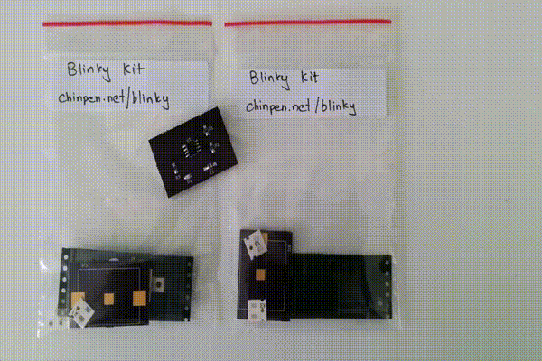
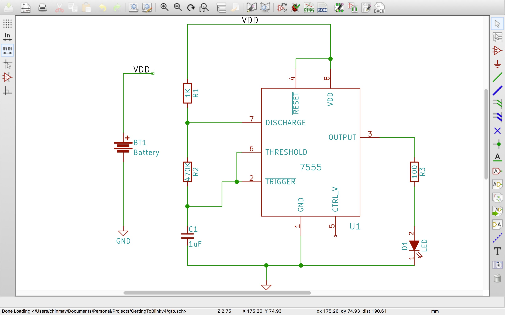
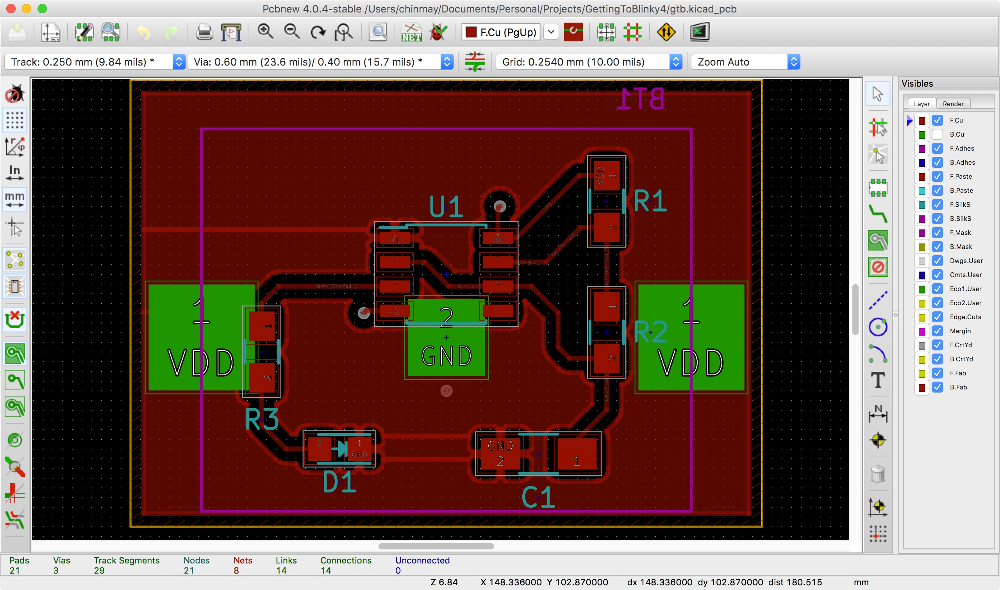
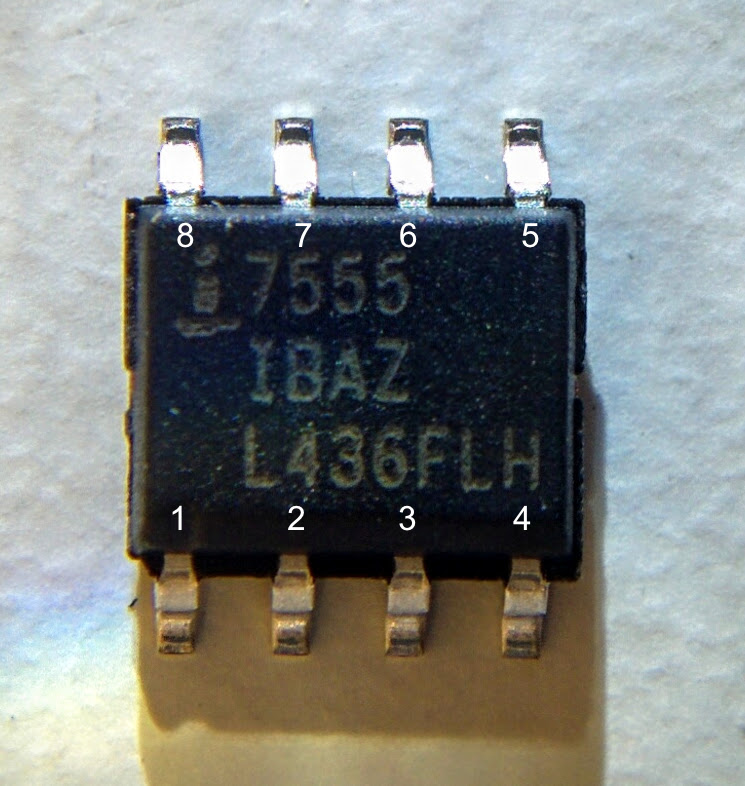
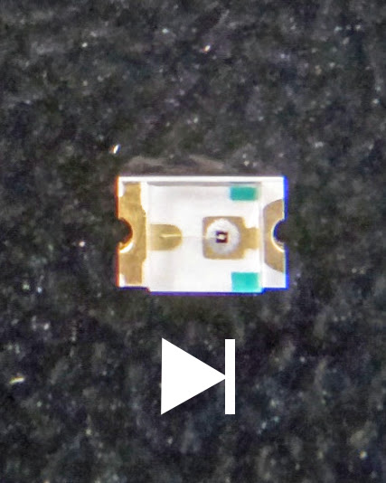

# Getting to Blink 4

This is a repository of (mostly) KiCad files created when following the online KiCad (and basic PCB design) tutorial by [Chris Gammel](chrisgammell.com). You can follow along the tutorial on [this YouTube playlist](https://www.youtube.com/watch?v=JN_Y93RTdSo&list=PLy2022BX6Eso532xqrUxDT1u2p4VVsg-q)

## PCB Design

This design has a couple of changes compared to Chris's design. At the end of the tutorial series Chris realises that the resistance on his LED was too high, making the LED very dim. So I changed the value of R3 from 1KΩ to 100Ω.

I was unable to find 470kΩ 0805 resistors for R2 so I switched to the nearest value I found which was 510kΩ (this should only affect the frequency of blinking)

## Layout

Since I was using OSHPark for PCB Fabrication, which charges per sq-inch, I tried to reduce the area of the PCB by making the layout of the battery holder as small as I could.

## Soldering

A major issue when soldering was the orientation of various componets. Two components are sensitive to orientation and need to be oriented correctly for the circuit to work.

- U1 (7555) : This timer IC doesn't have a notch denoting the first pin of the IC. The following figure shows the correct orientation of the IC and the related pin numbers.

- D1 : The LED is also sensitive to orientation. On the PCB, the arrow (→) on the silkscreen indicates the direction of the LED. On the package itself a faint green line indicates the direction of the LED. Align the two and LED will be correctly oriented.

## Components

One minor issue was that I accidently sourced for a 0805 capacitor package instead of a 1206. That's also not really a problem as it is possible to solder a 0805 capacitor onto a 1206 footprint.
